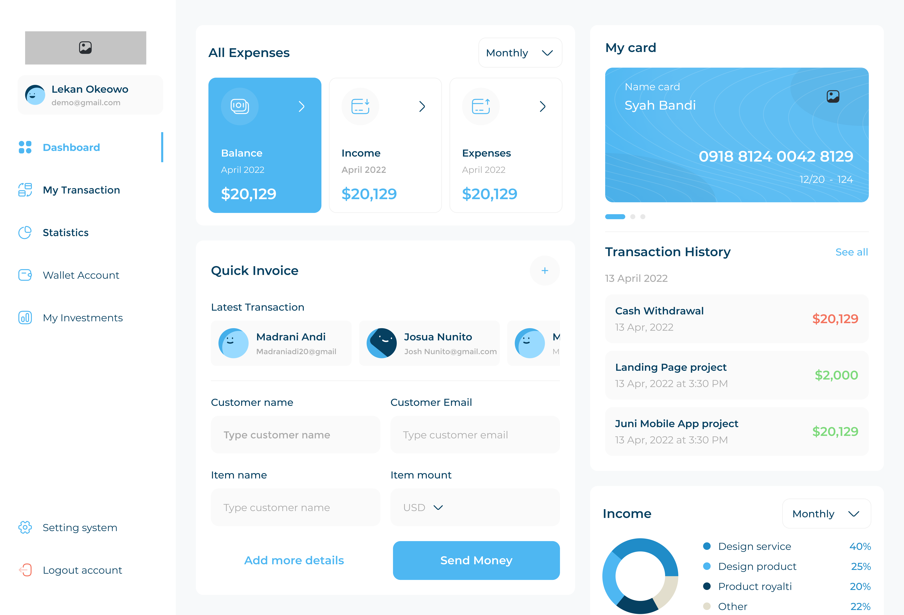
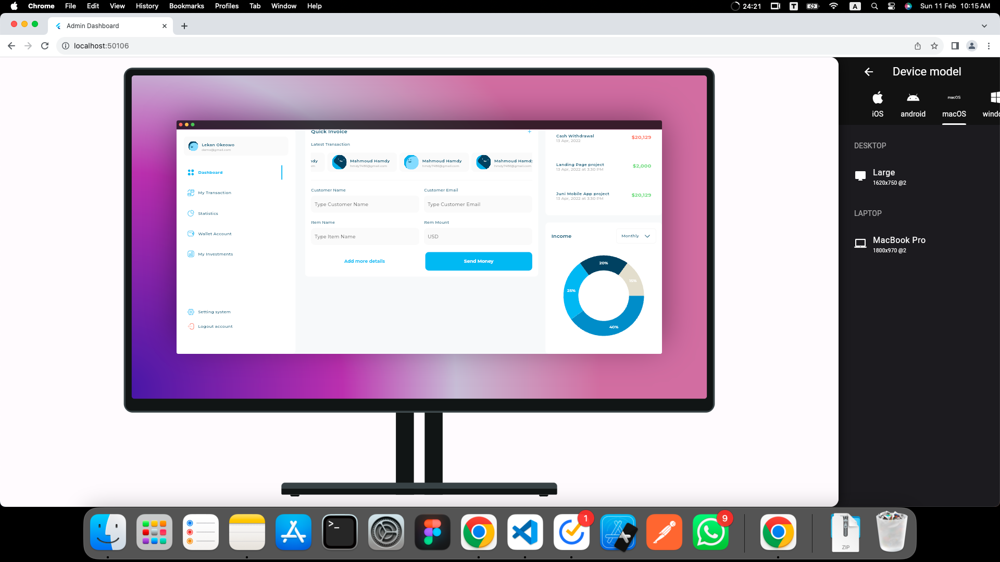
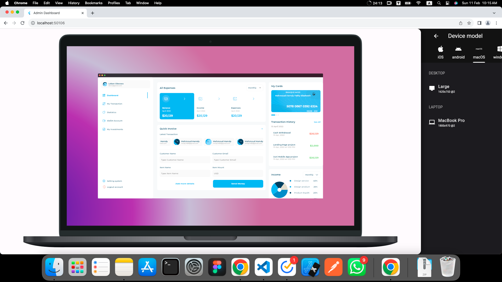
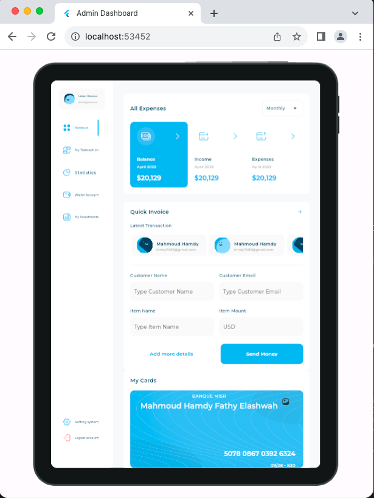
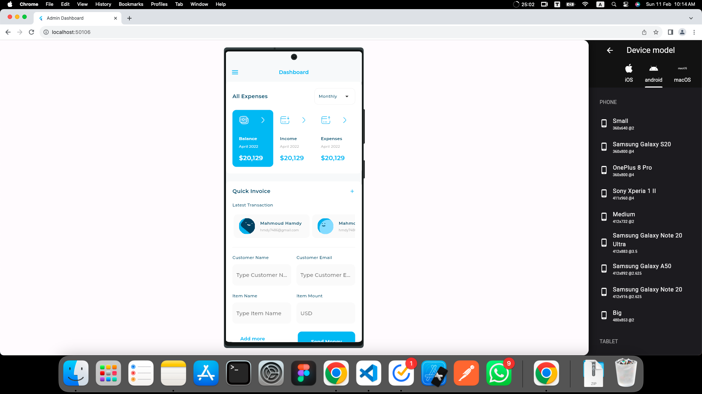
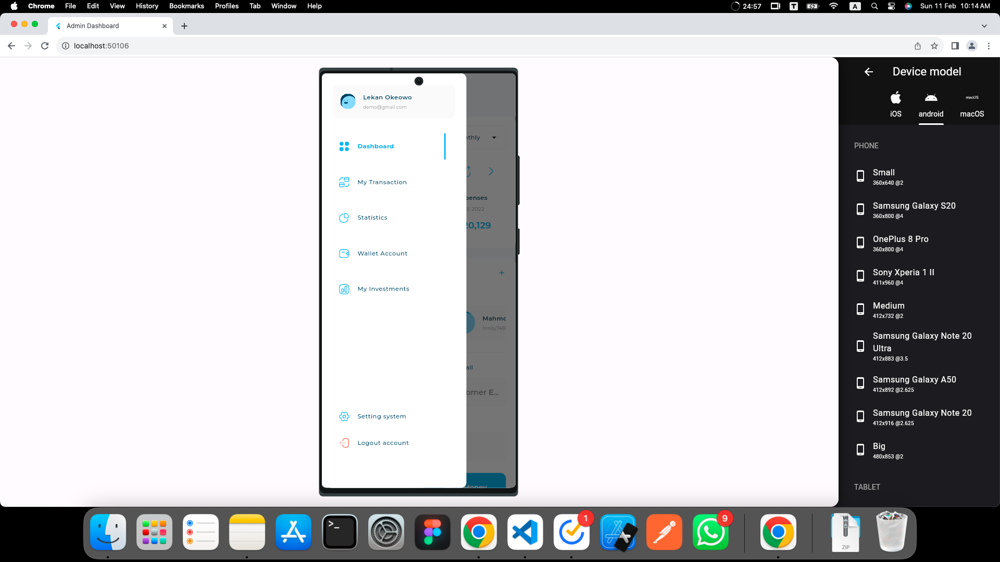
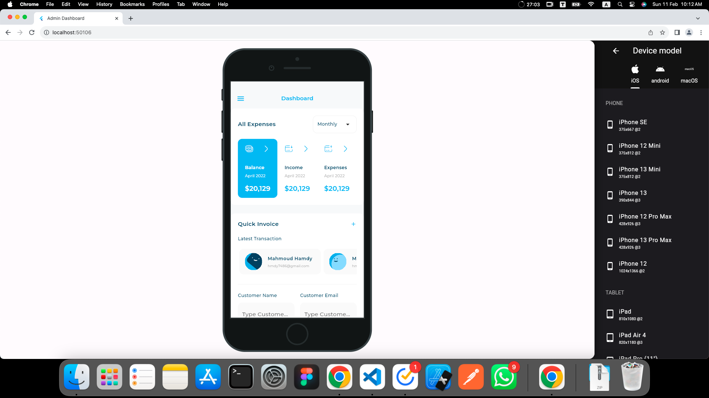

# Admin Dashboard

Welcome to the Admin Dashboard project! This dashboard provides administrators with a comprehensive overview of key metrics and data relevant to their responsibilities. It is designed to be responsive and adaptive, ensuring a seamless experience across various devices.

## Getting Started

### Screenshots

#### Desktop Preview

- **Windows**
  

    
  

- **Mac**
  

    
  

- **Mac Book Pro**
  

    
  

#### Tablet Preview

  

#### Mobile Preview

   &nbsp;&nbsp;&nbsp;&nbsp;
  

#### Small Mobile Preview

  

## Features

- **Responsive Design:** The dashboard is optimized for desktop, tablet, and mobile devices, ensuring a consistent and intuitive user experience across different screen sizes.
- **Adaptive Layout:** Utilizing Flutter's adaptive layout features, the dashboard adjusts dynamically to accommodate varying screen resolutions and orientations.
- **Data Visualization:** Key metrics and data are presented in visually appealing charts and graphs, making it easy for administrators to analyze and interpret information.
- **User-Friendly Interface:** The dashboard features a clean and intuitive interface, allowing administrators to navigate seamlessly and access relevant information efficiently.

## Tech Stack

- **Flutter:** Flutter is used for building the cross-platform user interface, enabling the development of a single codebase for multiple platforms.
- **Responsive Design:** The dashboard's responsiveness is achieved through Flutter's layout widgets and media queries, ensuring optimal rendering on different devices.
- **Device Preview:** Device Preview package is utilized for testing the dashboard's appearance and functionality across various devices directly within the Flutter IDE.
- **Charts:** Flutter's charting libraries are leveraged to create interactive and visually appealing charts for data visualization.

## Feedback and Contributions

Feedback and contributions to the Admin Dashboard project are welcome! If you have any suggestions, feature requests, or would like to contribute to the development, feel free to open an issue or submit a pull request on GitHub.

With the Admin Dashboard, administrators can stay informed and effectively manage their responsibilities with ease. Whether on a desktop, tablet, or mobile device, the dashboard provides a user-friendly interface for accessing critical information at a glance.
